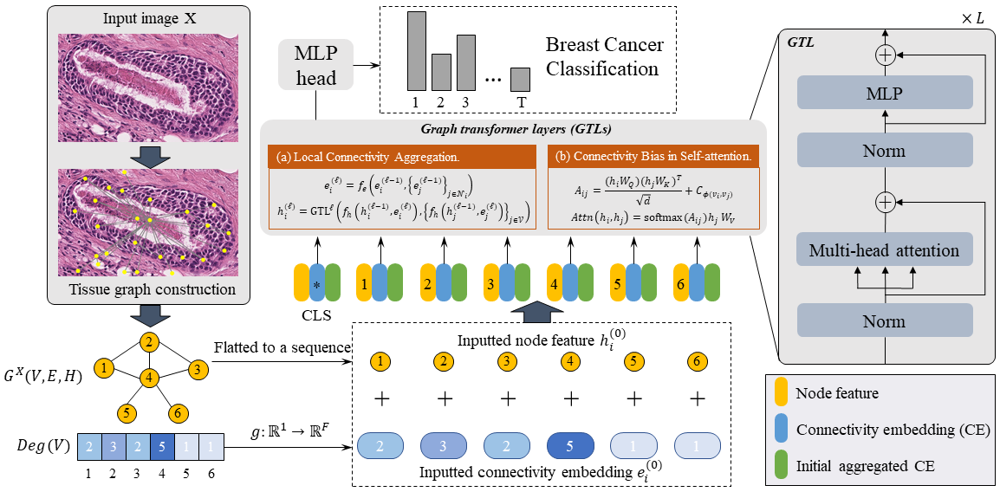

This repository contains the code to reproduce results of the [Breast Cancer Classification from Digital Pathology Images via Connectivity-aware Graph Transformer]() paper. 





Clone this repository, create a conda environment and activate it:

```
git clone <this repository>
conda env create -f environment.yml
conda activate cgt
```


Running CGT requires 3 steps:


All the experiments are based on the BRACS dataset. BRACS is a dataset of Hematoxylin and Eosin (H&E) histopathological images for automated detection/classification of breast tumors. BRACS includes >4k tumor regions-of-interest labeled in 7 categories (Normal, Benign, UDH, ADH, FEA, DCIS, Invasive). 

In order to download the BRACS dataset, you need to create an account [there](https://www.bracs.icar.cnr.it/). Then, go to `Data Collection`, `Download`, and hit the `Regions of Interest Set` button to access the data. Download the `previous_version` data. The data are stored on an FTP server. 


We provide a script for TG construction, which highly relies on the [`histocartography`](https://github.com/histocartography/histocartography) library.

```
cd core
python build_tg.py
```

After such construction, the TG is constructed in [*.bin] file format and the data dir should look like:

```
data
|
|__ tissue_graphs
    |
    |__ train
    |
    |__ test
    |
    |__ val
```


We provide a script for training CGT as:

```
python train.py
```

To set more parameters, we provide the usage as:

```
usage: train.py [-h] [--tg_path TG_PATH]
                [-conf CONFIG_FPATH]
                [--model_path MODEL_PATH] [--in_ram] [-b BATCH_SIZE]
                [--epochs EPOCHS] [-l LEARNING_RATE] [--out_path OUT_PATH]
                [--logger LOGGER]

optional arguments:
  -h, --help            show this help message and exit
  --tg_path TG_PATH     path to tissue graphs.
  -conf CONFIG_FPATH, --config_fpath CONFIG_FPATH
                        path to the config file.
  --model_path MODEL_PATH
                        path to where the model is saved.
  --in_ram              if the data should be stored in RAM.
  -b BATCH_SIZE, --batch_size BATCH_SIZE
                        batch size.
  --epochs EPOCHS       epochs.
  -l LEARNING_RATE, --learning_rate LEARNING_RATE
                        learning rate.
  --out_path OUT_PATH   path to where the output data are saved (currently
                        only for the interpretability).
  --logger LOGGER       Logger type. Options are "mlflow" or "none"
```

The output of this script will be a directory containing three models corresponding to the best validation loss, validation accuracy and weighted F1-score. 


We provide a pretrained [checkpoint](./core/logs), of which the test weighted F1 score is 66.9%.

We also provide a script for running inference with the option to use a pretrained model.

For instance, running inference with a pretrained CGT model: 

```
python inference.py
```


